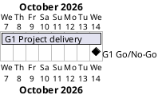

# Project Plan

## Metadata
| Key | Value |
| --- | --- |
| ID | PP-001 |
| CrossReference | [BC-001], [SA-001], [MIL-001] |
| Language | en |
| Domain | it |

## Version History
| Date | Status | Author | Reviewer | Change | Commit |
| --- | --- | --- | --- | --- | --- |
| 2026-10-07 | Accepted | Jens Tirsvad Nielsen | S01 | Initial version | [c55db0e] |

---

## Purpose

Schedules the single delivery phase of the Pretty Table assignment so that the repository can be published within one week, as the Business Case's small-scope constraint implies.

## Planning Assumptions

- Week 1 starts 2026-10-07; the plan ends by 2026-10-14.
- One phase of one week; the Product Owner (S01) is the only decision maker, per [SA-001].

## Gateway Schedule

| Gateway | Document | Window | Decision date | Owner | Stories | Main deliverable | Milestone |
| --- | --- | --- | --- | --- | --- | --- | --- |
| G1 Project delivery | [MIL-001] | 2026-10-07 to 2026-10-14 | 2026-10-14 | S01 | none | Tested, documented Python project and published repository metadata | |



## Scope Coverage

| Business Case scope item | Gateway |
| --- | --- |
| Source under `src/`, tests under `tests/`, documents under `docs/` | G1 |
| `pyproject.toml`, `.gitignore`, `Doxyfile`, README | G1 |
| Repository description and topics | G1 |

## Dependencies

```
G1 Project delivery
```

A No-Go on G1 moves the decision date until the failed criteria are fixed.

## Plan Risks

| Risk | Impact | Mitigation |
| --- | --- | --- |
| Git host API is unavailable for description and topics | Task cannot be completed | Set them by hand on the repository page |

## Open Issues

- The assignment's exact function names are not given in the task text; the code uses `create_table` and `main`, to be adjusted if S01 names others.

---

[BC-001]: ./business-case.md
[SA-001]: ./stakeholder-analysis.md
[MIL-001]: ./milestones/mil-001-pretty-table-project.md
[c55db0e]: https://git.tirsystem.com/Tirsvad-Udemy-100_days_of_code/016-pretty_table/commit/c55db0e0f2f7c259018b85a90824b124cc0b780d
